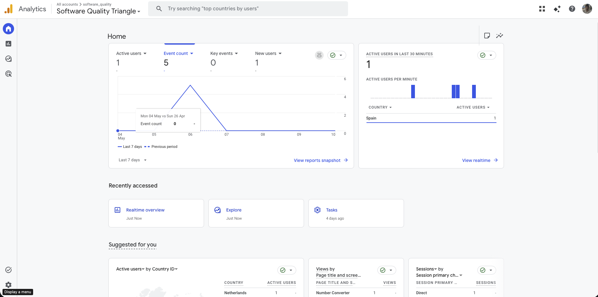
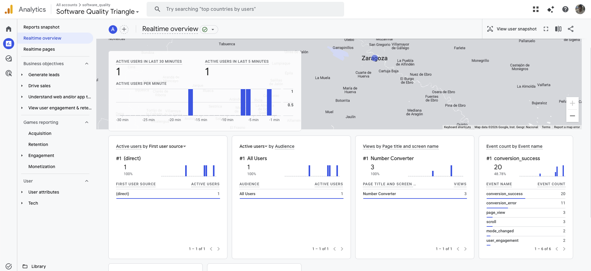



# Overview

The Roman Number Converter is a single-page tool that converts integers to Roman numerals and vice versa. Google Analytics 4 was integrated to go beyond passive traffic measurement and capture how users actually interact with the converter, which modes they use, when they succeed, and where they fail.

**Live URL:** https://juanizn.github.io/RomanNumbers/

**Repo:** https://github.com/JuanIzn/RomanNumbers/

# Events Tracked

Three custom events were added beyond the default `page_view`:

| Event | Trigger | Parameters |
|---|---|---|
| `conversion_success` | User converts successfully | `conversion_mode` |
| `conversion_error` | Input is invalid or out of range | `conversion_mode`, `error_message` |
| `mode_changed` | User switches the dropdown | `selected_mode` |

**`conversion_success`** is the core success metric of the tool. The `conversion_mode` parameter reveals whether users prefer Integer → Roman or Roman → Integer — the most actionable insight a converter can produce.

**`conversion_error`** exposes UX friction. Knowing which error message appears most often (e.g. *"not in canonical form"*) points directly to what needs clearer labeling or a better placeholder.

**`mode_changed`** distinguishes exploratory users from one-shot users, showing whether the dual-mode design adds value or goes unnoticed.

# GA4 Dashboard

*GA4 → Reports → Engagement → Events. All three events appear within minutes of firing. Even at low traffic, DebugView confirms correct event names and parameters on every interaction.*

